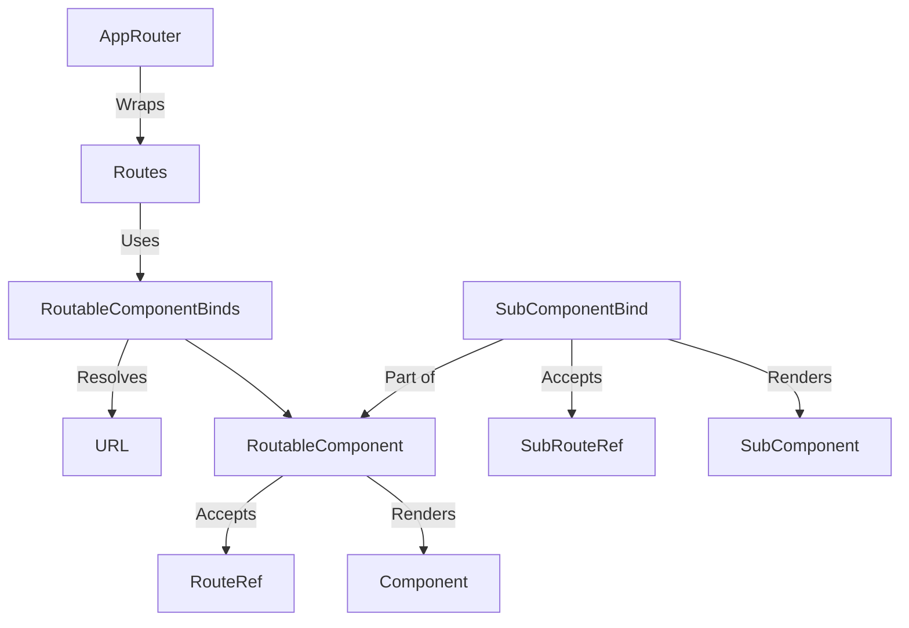

# CatCode.Frontend.Routing

CatCode.Frontend.Routing is a helper package to simplify routing in a react app. Instead of manually specifying urls as string you use route references (routeRef) that will at runtime be bound to a string representation.

This package includes the following high level concepts

# Requirements
Programatic 

## Route Reference 
* RouteRef - a programmatic representation of a route to be used through the an app
* SubRouteRef - A sub route of a RouteRef
* ExternalRouteRef - a route reference use to reference routes outside of current scope. will be bound to a route ref at runtime.
* bindExternalRouteRef - function used to bind route ref and external route ref at runtime.
* useRouteRef - function that takes a routeRef as input and returns a callable that can upon call constructs the path.
* useRouteRefParams - function that allows you to use current routeRef url parameters

## Route Handlers
* AppRouter - An extension of the react router dom BrowserRouter that includes a route resolver to make it integrate with route refs.
* Routes - 
* RoutebleComponent
* RoutableComponentBind

---
Other lower level concepts exists though these are not needed to set up routing in an app.

# Questions
* How to handle multiple subcomponents in routable component
* How to build routable component bind and add to Routes