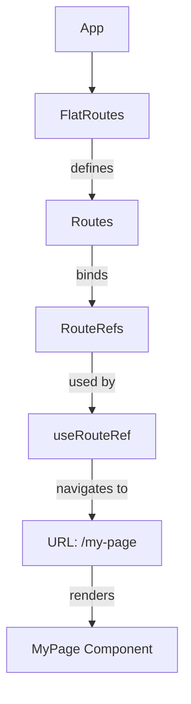

```mermaid

graph TD;
    A[App] --> B[FlatRoutes];
    B -->|defines| C[Routes];
    C -->|binds| D[RouteRefs];
    D -->|used by| E[useRouteRef];
    E -->|navigates to| F[URL: /my-page];
    F -->|renders| G[MyPage Component];

```