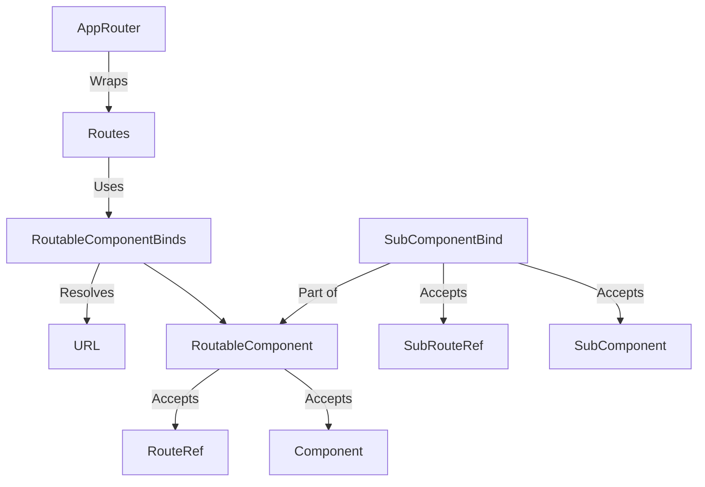

# Software Design Document Template

## Project Overview
**Project Name:**  
CatCode.Frontend.Routing

**Project Summary:**  
When building react apps with multiple pages you often have to hardcode a url in multiple places. This project creates utilities to help you reference urls in multiple places but only at runtime bind it to an actual string representation.

Additionally it will include helpers to build routes including nested routes.

**Objectives:**  
* Programmatically reference and interact with routes in code
* Automate setup of react router and routes

---

## Define Objectives and Requirements
**Problem Statement:**  
[Describe the problem the software will solve.]

**Functional Requirements:**  
- Programmatically reference routes 
- Programmatically reference external routes
- Automate route build  
- ...

**Non-Functional Requirements:**  

**User Personas:**  

**Success Metrics:**  
[List the metrics that will define project success.]

---

## Research and Analyze
**Existing Solutions:**  
Backstage has a similar solution from which this takes a lot of inspiration.

**Technology Research:**  
* Typescript
* React
* jest for testing

---
## Draft High-Level Concept
**Core Features:**  
- **RouteRef:** A programmatic representation of a route to be used throughout an app.  
- **SubRouteRef:** A sub-route of a RouteRef.  
- **ExternalRouteRef:** A route reference to external routes, bound to a route ref at runtime.  
- **bindExternalRouteRef:** A function used to bind RouteRefs and ExternalRouteRefs at runtime.  
- **useRouteRef:** A hook that takes a RouteRef as input and returns a callable that constructs the path when called.  
- **useRouteRefParams:** A hook to access current RouteRef URL parameters.  
- **AppRouter:** An extension of the React Router DOM `BrowserRouter` that includes a route resolver to integrate with RouteRefs.  
- **Routes:** A component for defining app routes based on RouteRefs.  
- **RoutableComponent:** A wrapper for components that depend on a RouteRef.  
- **RoutableComponentBind:** A helper for rendering RoutableComponents with dynamic bindings.  

**Scope:**  
- **Included:**  
  - Utilities for programmatically defining and binding routes.  
  - React Router DOM integration.  
  - Support for nested routes and external route references.  
- **Excluded:**  
  - Advanced features like route-based authorization (future scope).  
  - Non-React frameworks or routing libraries.  

## Create the Software Architecture
**Architecture Pattern:**  
A single typescript library

**System Components:**  
1. **Route Management Module:** Handles creation and binding of RouteRefs.  
2. **Routing Utilities:** Provides hooks like `useRouteRef` and `useRouteRefParams`.  
3. **Integration Components:** Includes `AppRouter`, `Routes`, and helpers for route rendering.  

**Data Flow:**  

---

## Select Technology Stack
**Programming Languages:**  
* Typescript

---

## Prototype and Validate
**MVP Features:**  
[List the features to include in the MVP or prototype.]

**Validation Steps:**  
[Describe how to validate the software against requirements.]

---

## Develop and Test
**Development Workflow:**  
[Describe the chosen development methodology, e.g., Agile, Scrum.]

**Testing Strategy:**  
jest will be used for unit tests

**Feature Roadmap:**  
[Describe plans for adding new features or updates over time.]
